# school-projects

Showcase of some interesting projects I've done during college.

The purpose of this repo is to allow me to fondly remember college times with ease. It is also open for anyone to take a look :)

## About the classes

Bachelor's lasted 3 years (two semesters each) and Master's – 2 years (two semesters each). The *italicized* number after the name of a class is the semester I attended it in.

Some classes/disciplines naturally lend themselves more to visualization (i.e: Computational Graphics).

Some tend to be too theoretical/mathematical:

* Mathematical and Computational Logic _(1)_
* Mathematical Analysis/Calculus _(1 & 2)_
* (Linear) Algebra _(1 & 2)_
* Calculability & Complexity *(3)*
* Logic Programming *(4)*
* Partial Derivatives and Differential Equations *(5)*
* Declarative Programming *(6)*
* (Mathematical) Optimization Techniques *(6)*

Some are just not too visual:

* Psychopedagogy *(1 - 4)*
* Databases *(4)*
* Database Management Systems *(5)*

And finally, some classes required bigger projects – which received a repo all by themselves:

* Software Development Methodologies *(4)* – [Senile de Foc](https://github.com/stefan1niculae/senile-de-foc)
* Web Development *(5)* – [Blacksmith](https://github.com/stefan1niculae/blacksmith)
* Software Engineering *(6)* – [EasyVim](https://github.com/stefan1niculae/easyVim)

## About the projects

As I attended college in Romania, (parts of) some projects are written in romanian – signaled with a flag  🇷🇴.

I will include one/two screenshots, or a gif, if appropriate, for each project.

The name inside [brackets] is the (main) language of the project.

## Semester 1

## Semester 2

### Object Oriented Programming

#### Big Numbers 🇷🇴

Data structure and operations for big integer and real numbers. [C++]

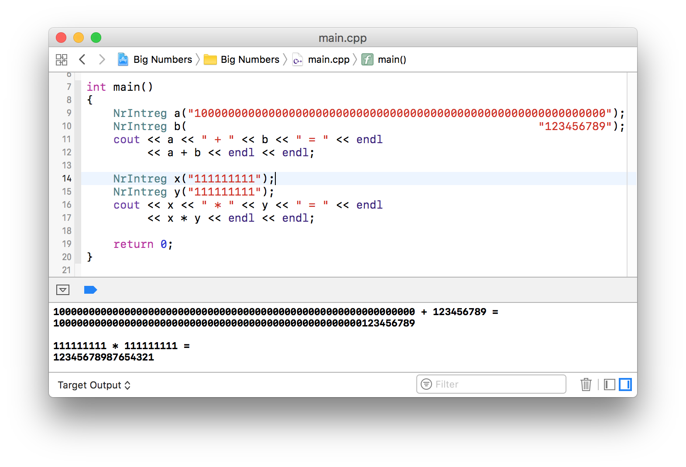

### Geometry

#### Octonions 🇷🇴

Essay on Octonions and Cayley's Algebra. 

### Algebra II

#### Matrix Operations 🇷🇴

Row-wise operations including Polynomial arithmetic. For calculating the determinant or for finding the Jacobian matrix. [C++]

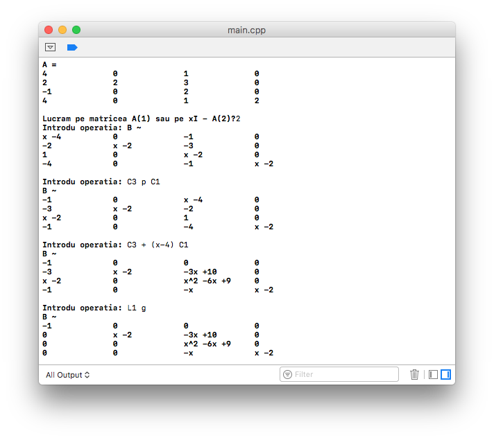

## Semester 3

### Statistics and Probabilities

#### Does Money Come with Age? 🇷🇴

Statistical exploration of wether income correlates with age. [R]

 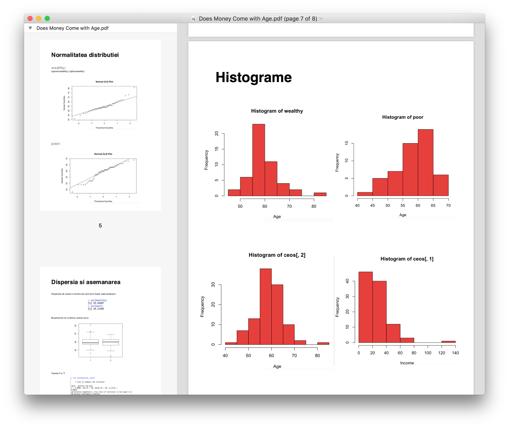

### Computer Graphics

#### Triangulation

Checks wether a given point is inside (or on an edge)  a shape via triangulation. [Java]

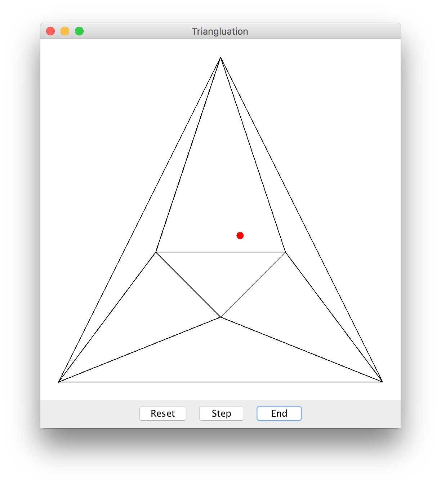

### Calculability & Complexity

#### Multiplying Machine

Turing Machine for multiplying a number by a constant. [JFLAP]

### Advanced Programming Techniques

#### Tired Explorer

An explorer walks from the top of the map to the bottom. Each cell requires a certain amount of effort. Greedy implementation to find the optimal path — with matrix visualization. [Java]

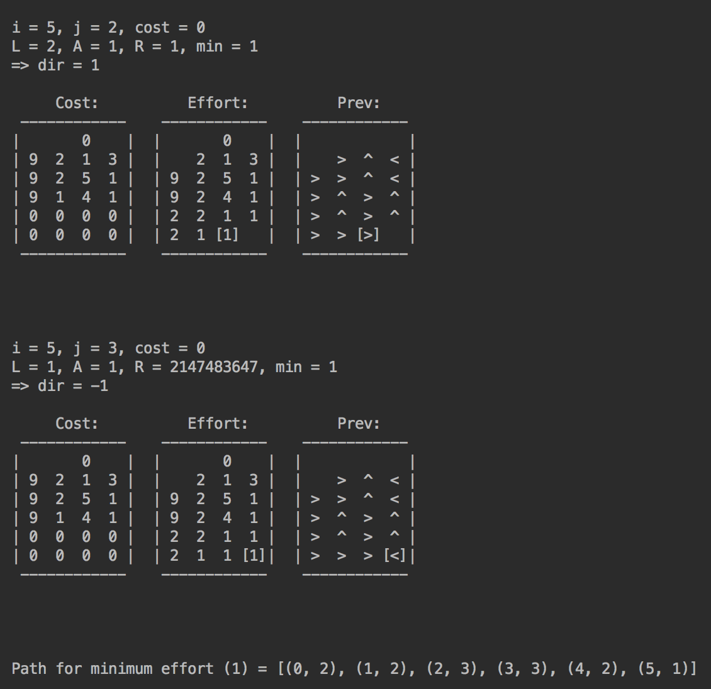

## Semester 4

### Web Techniques

#### Time Flies

Simple game done in vanilla html, js & css. The idea is to catch as many hourglasses as you can. The more you catch, the faster they come (launched in a random direction). [JavaScript] 

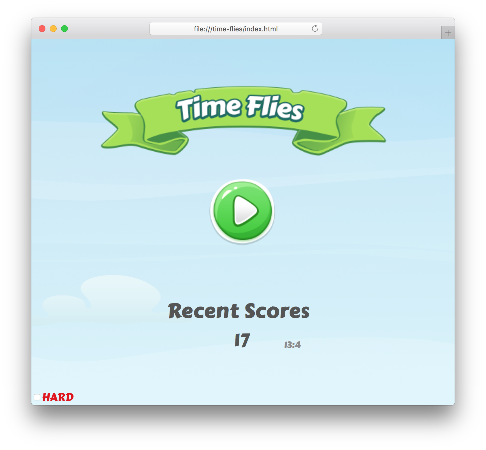
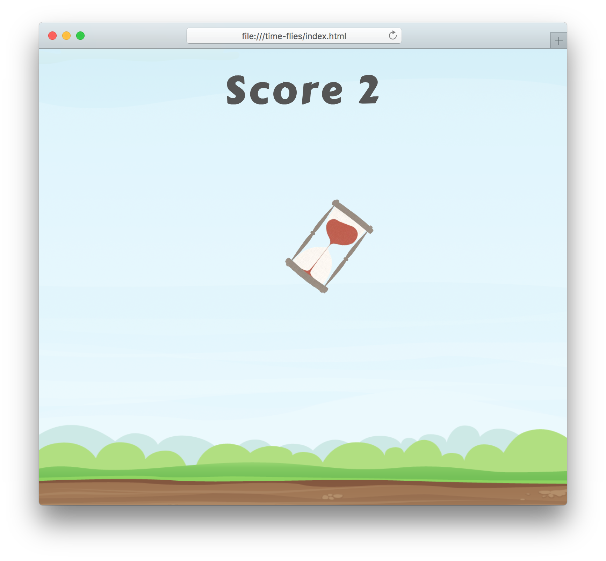

### Artificial Intelligence

#### Point Classification

Perceptron implementation for 2D-points classification. [Matlab]

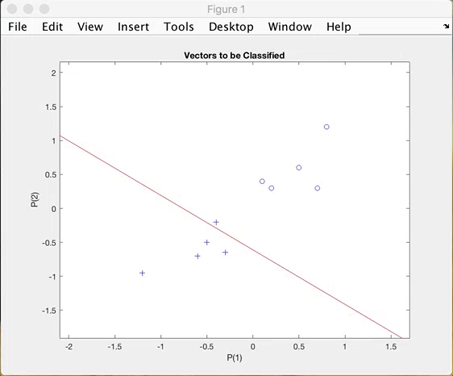

#### 3D Loss

Visualization of loss function for three parameters. [Matlab]

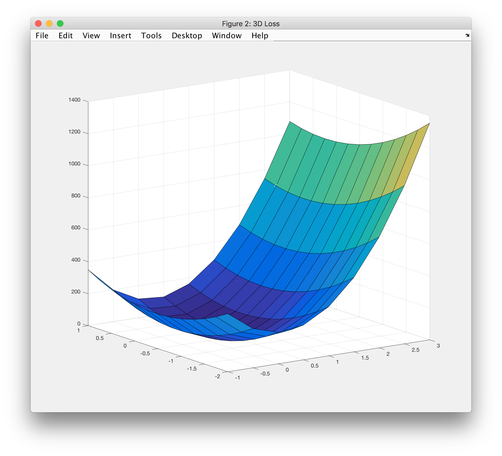

### Letter Recognition

Noisy letters recognized using the Neural Network Toolbox. [Matlab]

### Advanced Object Oriented Programming

#### Calculator

Uses a client-server architecture. [Java]

#### Chatroom

Broadcast and peer-to-peer cross-process communication. [Java]

 

#### Contacts

Simple CRUD website for contacts management. [JSP]

### Didactics of Informatics

#### Random Points 🇷🇴

Small paper on uniformly generating points inside a polygon. [Latex]

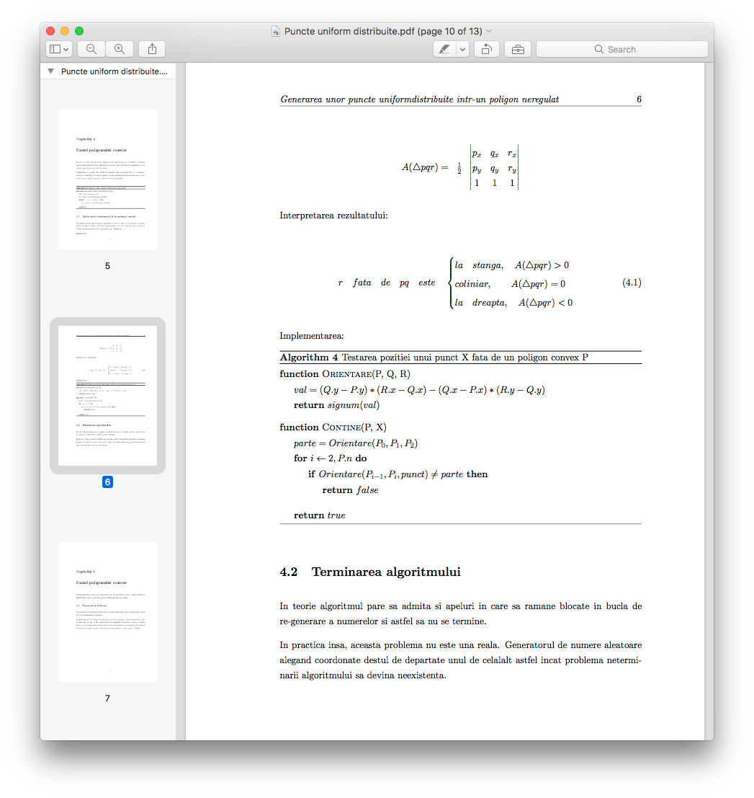

### Software Development Methodologies

#### Exam Cheatsheet

Managed to fit the entire material in just under three pages.

## Semester 5

### System Simulation Techniques

#### Store Planning Improvement 🇷🇴

Simulation for a real food store with the goal of improving lunch-time customer flow. [GPSS]

 

### Geometry Concepts for Computer Graphics

#### 2D Birds

2D birds (that look like bats) which move on a mouse-defined path [OpenGL].

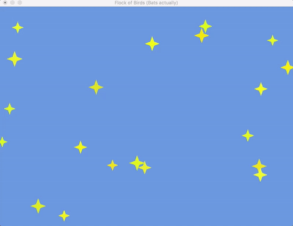

#### 3D Dinosaurs

3D dinosaurs in a lighted scene which can be observed by flying around [OpenGL].

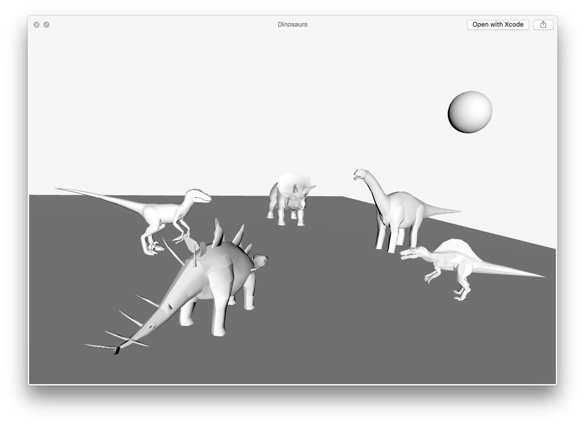

## Semester 6

### Compilation Techniques

#### Python Lexer

Python code syntactical lexer, from scratch. [Python].

 

Automaton diagram ([full-size](https://raw.githubusercontent.com/stefan1niculae/school-projects/master/Python%20Lexer/DFA%20diagram.png)):

## Semester -1

Bonus: high-school

#### Snake 🇷🇴

Moves once per second, opens its mouth and loves special food. [C++]

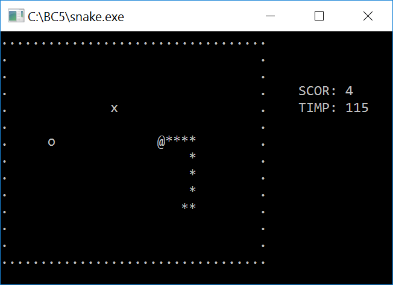

#### Whist 🇷🇴

 Helps you with the arithmetics needed for the card game _Whist_. [C++]

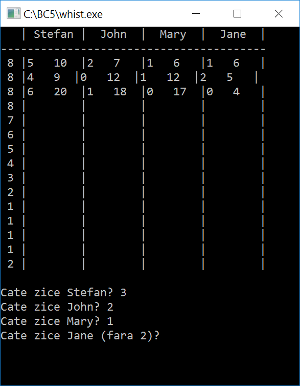