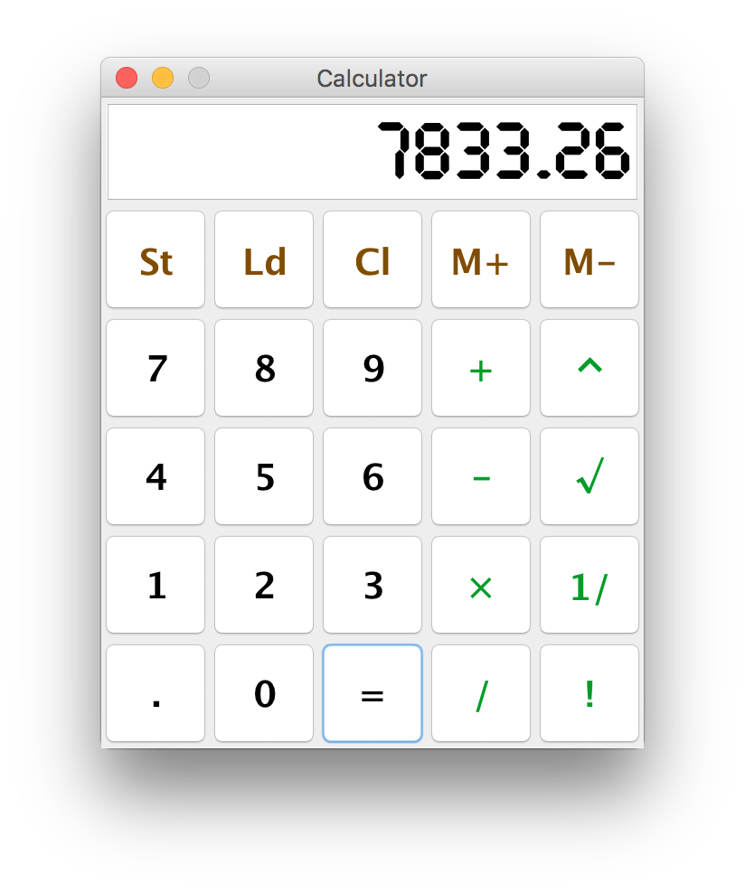
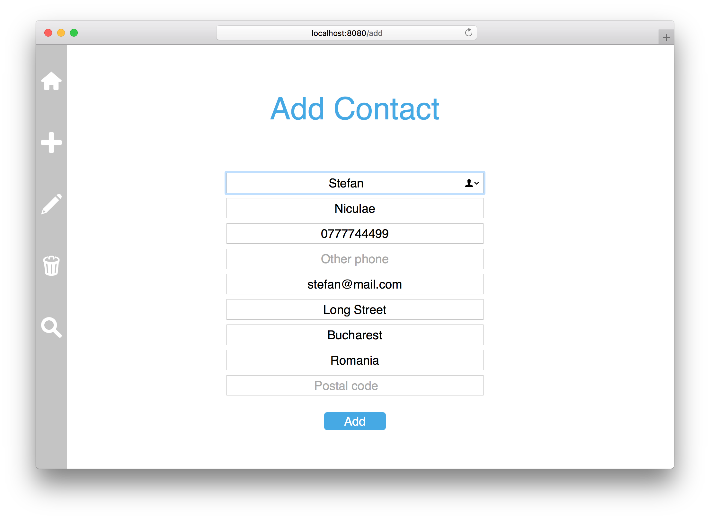
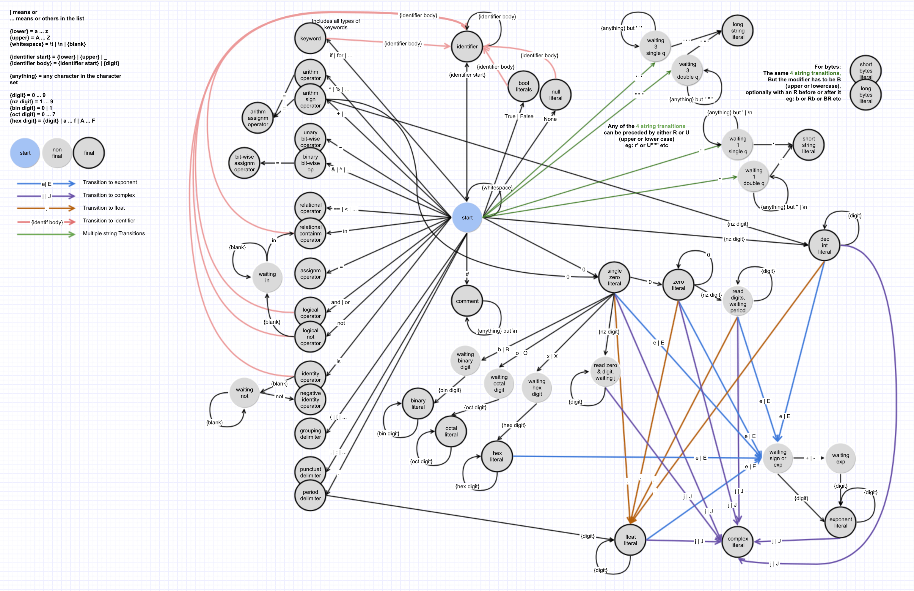

# school-projects

Showcase of some interesting projects I've done during college.

The purpose of this repo is to allow me to fondly remember college times with ease. It is also open for anyone to take a look :)

## About the classes

Bachelor's lasted 3 years (two semesters each) and Master's – 2 years (two semesters each). The *italicized* number after the name of a class is the semester I attended it in.

Some classes/disciplines naturally lend themselves more to visualization (i.e: Computational Graphics).

Some tend to be too theoretical/mathematical:

* Mathematical and Computational Logic _(1)_
* Mathematical Analysis/Calculus _(1 & 2)_
* (Linear) Algebra _(1 & 2)_
* Logic Programming *(4)*
* Partial Derivatives and Differential Equations *(5)*
* Declarative Programming *(6)*
* (Mathematical) Optimization Techniques *(6)*

Some are just not too visual:

* Psychopedagogy *(1 - 4)*
* Databases *(4)*
* Database Management Systems *(5)*

And finally, some classes required bigger projects – which received a repo all by themselves:

* Software Development Methodologies *(4)* – [Senile de Foc](https://github.com/stefan1niculae/senile-de-foc)
* Web Development *(5)* – [Blacksmith](https://github.com/stefan1niculae/blacksmith)
* Software Engineering *(6)* – [EasyVim](https://github.com/stefan1niculae/easyVim)

## About the projects

I will include one/two screenshots, or a gif, if appropriate, for each project.

The name inside [brackets] is the (main) language of the project.

## Semester 1

## Semester 2

## Semester 3

## Semester 4

### Advanced Object Oriented Programming

#### Calculator

Uses a client-server architecture. [Java]

#### Contacts

Simple CRUD website for contacts management. [JSP]

## Semester 5

## Semester 6

### Compilation Techniques

#### Python Lexer

Python code syntactical lexer, from scratch. [Python].

 

Automaton diagram ([full-size](https://raw.githubusercontent.com/stefan1niculae/school-projects/master/Python%20Lexer/DFA%20diagram.png)):

