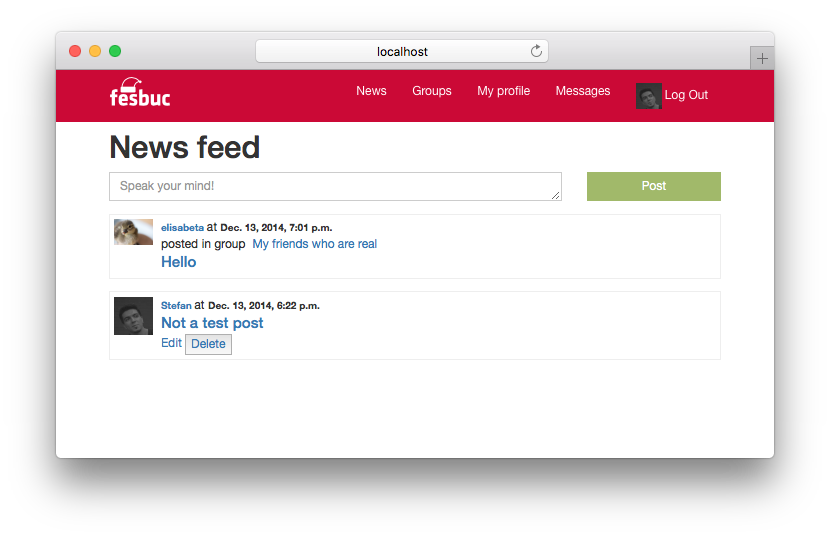

# school-projects

Showcase of some interesting projects I've done during college.

This repo has three purposes:

- allow me to take a trip down the memory lane
- answer the question _what am I going to do at college?_ for students interested in this faculty
- enable anyone curious to take a look at what I've done

## About the projects

Each project has a one-line description and an accompanying screenshot (or gif).

The [link](https://github.com/stefan1niculae/school-projects) mentions the project's language and points to its source.

A flag 🇷🇴 indicates that the project is written in romanian.

I have included both projects with an interesting outcome, and ones that are stand out through their implementation.

Earlier projects may not seem as impressive — their TODO

## About the classes

Classes are presented chronologically and grouped by semester. Each class features one or two significant projects.

**Bachelor's** lasted 6 semesters (three years) and **Master's** — 4 semesters (two years).

Some classes naturally lend themselves more to visualization (i.e: Computer Graphics).

Some tend to be too theoretical/mathematical:

* Mathematical and Computational Logic _(semester 1)_
* Mathematical Analysis/Calculus _(semesters 1 & 2)_
* (Linear) Algebra _(semesters 1 & 2)_
* Calculability & Complexity *(semester 3)*
* Logic Programming *(semester 4)*
* Partial Derivatives and Differential Equations *(semester 5)*
* Declarative Programming *(semester 6)*
* (Mathematical) Optimization Techniques *(semester 6)*
* Numerical Analysis *(semester 6)*

Some are just not too visual:

* Psychopedagogy *(semesters 1 - 4)*
* Databases *(semester 4)*
* Database Management Systems *(semester 5)*

And, unfortunately, cannot be showcased in this format, as a screenshot and one-liner won't do them justice.

Some classes required bigger projects — they each get a separate repo:

* Software Development Methodologies *(semester 4)* – [Senile de Foc](https://github.com/stefan1niculae/senile-de-foc)
* Web Development *(semester 5)* – [Blacksmith](https://github.com/stefan1niculae/blacksmith)
* Software Engineering *(semester 6)* – [EasyVim](https://github.com/stefan1niculae/easyVim)

## Semester 1

### Algorithms and Data Structures

#### AVL Tree 🇷🇴

[C++] Binary Search Tree balancing with graphic representation.

### Computer Architecture

#### Registers Stack 🇷🇴

[Assembly] Read/write of a stack data structure implemented in a MIPS simulator.

## Semester 2

### Formal Languages and Automata

#### Chomskify 🇷🇴

[C++] Transform a Context-Free Grammar into Chomsky Normal-Form.

### Object Oriented Programming

#### Big Numbers 🇷🇴

[C++] Data structure and operations for big integer and real numbers.

### Geometry

#### Octonions 🇷🇴

[Link] Essay on Octonions and Cayley's Algebra.

### Algebra II

#### Matrix Operations 🇷🇴

[C++] Row-wise operations including Polynomial arithmetic, for calculating the Jacobian matrix. 

## Semester 3

### Python Web Dev

#### Fesbuc

[Python] Social network clone developed during the end-of-semester hackathon.

### Statistics and Probabilities

#### Does Money Come with Age? 🇷🇴

[R] Statistical exploration of wether income correlates with age.

 

### Computer Graphics

#### Triangulation

[Java] Checks wether a given point is inside (or on an edge) of a shape via triangulation.

### Calculability & Complexity

#### Multiplying Machine

[JFLAP] Turing Machine for multiplying a number by a constant.

### Advanced Programming Techniques

#### Tired Explorer

[Java] An explorer walks from the top of the map to the bottom. Each cell requires a certain amount of effort. Greedy implementation to find the optimal path — with matrix visualization. 

## Semester 4

### Web Techniques

#### Time Flies

[JavaScript] Game in which you catch as many hourglasses as you can. The more you catch, the faster they come.

### Artificial Intelligence

#### Point Classification

[Matlab] Perceptron implementation for 2D-points classification.

#### 3D Loss

[Matlab] Visualization of loss function for three parameters. 

### Letter Recognition

[Matlab] Noisy letters recognized using the Neural Network Toolbox.

### Advanced Object Oriented Programming

#### Calculator

[Java] Simple calculator functions using a client-server architecture. 

#### Chatroom

[Java] Features broadcast and peer-to-peer cross-process communication. 

 

#### Contacts

[JSP] Simple CRUD website for contacts management.

### Didactics of Informatics

#### Random Points 🇷🇴

[Latex] Small paper on uniformly generating points inside a polygon.

### Software Development Methodologies

#### Exam Cheatsheet

Managed to fit the entire material in just under three pages.

## Semester 5

### System Simulation Techniques

#### Store Planning Improvement 🇷🇴

[GPSS] Simulation for a real food store with the goal of improving lunch-time customer flow.

 

### Geometry Concepts for Computer Graphics

#### 2D Birds

[OpenGL] Birds (that look like bats) which move on a mouse-defined path.

#### 3D Dinosaurs

[OpenGL] Dinosaurs in a lighted scene which can be observed by flying around.

## Semester 6

### Compilation Techniques

#### Python Lexer

 [Python] Syntactical lexer for Python, from scratch.

 

Automaton diagram ([full-size](https://raw.githubusercontent.com/stefan1niculae/school-projects/master/Python%20Lexer/DFA%20diagram.png)):

## Semester -1

Bonus: high-school

#### Snake 🇷🇴

[C++] Moves once per second, opens its mouth and loves special food.

#### Whist 🇷🇴

[C++] Helps you with the arithmetics needed for the card game _Whist_. 

