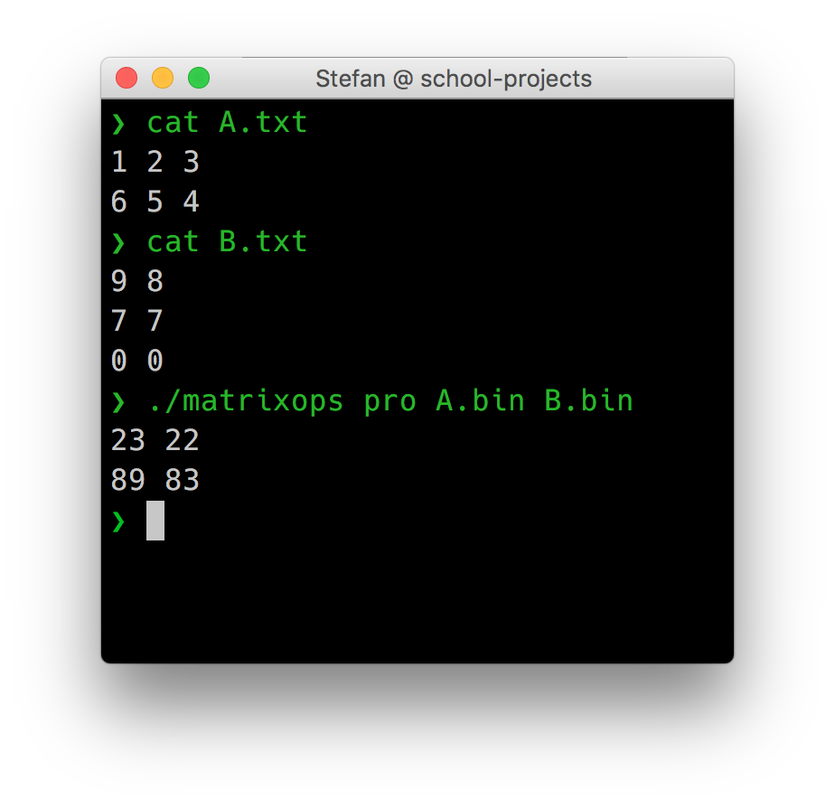

# school-projects

Showcase of some interesting projects I've done during college -- screenshots & source.

## Masters
### Year 1
TODO

## Bachelors
### Year 3
  - _Software Engineering_ – [EasyVim](https://github.com/stefan1niculae/easyVim)

  - _Web Development_ – [Blacksmith](https://github.com/stefan1niculae/blacksmith)

  - _Software Development Methodologies_ – [Senile de Foc](https://github.com/stefan1niculae/senile-de-foc)

Click too see screenshots & details: 

  

_Compilation Techniques_ - Python Lexer

  `Python` Syntactical lexer for Python, from scratch.
  
  Automaton diagram ([full-size](https://raw.githubusercontent.com/stefan1niculae/school-projects/master/Python%20Lexer/DFA%20diagram.png)):
  
  

  

_Geometry Concepts for Computer Graphics_ - 2D Birds

  `OpenGL` Birds (that look like bats) which move on a mouse-defined path.
  
  

  

_Geometry Concepts for Computer Graphics_ - 3D Dinosaurs

  `OpenGL` Dinosaurs in a lighted scene which can be observed by flying around.
  
  

  

_System Simulation Techniques_ - Store Planning Improvement

  `GPSS` Simulation for a real food store with the goal of improving lunch-time customer flow. 🇷🇴
  
  

  

Other Classes

  - Declarative Programming
  - Numerical Analysis
  - (Mathematical) Optimization Techniques
  - Partial Derivatives and Differential Equations
  - Database Management Systems
  

### Year 2
  

_Web Techniques_ - Time Flies

  `JavaScript` Game in which you catch as many hourglasses as you can. The more you catch, the faster they come.
  
  
  

  

_Artificial Intelligence_ - Point Classification

  `Matlab` Perceptron implementation for 2D-points classification.
  
  

  

_Artificial Intelligence_ - 3D Loss

  `Matlab` Visualization of loss function for three parameters.
  
  

  

_Artificial Intelligence_ - Letter Recognition

  `Matlab` Noisy letters recognized using the Neural Network Toolbox.
  
  

  

_Advanced Object Oriented Programming_ - Calculator

  `Java` Simple calculator functions using a client-server architecture.
  
  

  

_Advanced Object Oriented Programming_ - Chatroom

  `Java` Features broadcast and peer-to-peer cross-process communication.
  
  

  

_Advanced Object Oriented Programming_ - Contacts

  `JSP` Simple CRUD website for contacts management.
  
  
  

  

_Didactics of Informatics_ - Random Points

  `Latex` Small paper on uniformly generating points inside a polygon. 🇷🇴
  
  

  

_Python Web Dev_ - Fesbuc

  `Python` Social network clone developed during the end-of-semester hackathon.
  
  

  

_Statistics and Probabilities_ - Does Money Come with Age?

  `R` Statistical exploration of wether income correlates with age. 🇷🇴
  
  

  

_Computer Graphics_ - Triangulation

  `Java` Checks wether a given point is inside (or on an edge) of a shape via triangulation.
  
  

  

_Calculability & Complexity_ - Multiplying Machine

  `JFLAP` Turing Machine for multiplying a number by a constant.
  
  

  

_Operating Systems_ - Inplace Matrix

  `C` Addition or multiplication on matrices read from binary files, without storing them in memory. 🇷🇴
  
  

  

_Advanced Programming Techniques_ - Tired Explorer

  `Java` An explorer walks from the top of the map to the bottom. Each cell requires a certain amount of effort. Greedy implementation to find the optimal path — with matrix visualization.
  
  

  

_Software Development Methodologies_ - Exam Cheatsheet

  Managed to fit the entire material in just under three pages.
  
  

  

Other Classes

  * Calculability & Complexity
  * Logic Programming
  * Databases
  

### Year 1
  

_Formal Languages and Automata_ - Chomskify

  `C++` Transform a Context-Free Grammar into Chomsky Normal-Form. 🇷🇴
  
  

  

_Object Oriented Programming_ - Big Numbers

  `C++` Data structure and operations for big integer and real numbers. 🇷🇴
  
  

  

_Algebra II_ - Matrix Operations

  `C++` Row-wise operations including Polynomial arithmetic, for calculating the Jacobian matrix. 🇷🇴
  
  

  

_Geometry_ - Octonions

  `Link` Essay on Octonions and Cayley's Algebra. 🇷🇴
  
  

  

_Algorithms and Data Structures_ - AVL Tree

  `C++` Binary Search Tree balancing with graphic representation.
  
  

  

_Computer Architecture_ - Registers Stack

  `Assembly` Read/write of a stack data structure implemented in a MIPS simulator. 🇷🇴
  
  

  

Other Classes

  * Graph Theory
  * Mathematical and Computational Logic
  * Mathematical Analysis/Calculus
  * (Linear) Algebra
  * Procedural Programming
  * Psychopedagogy *(years 1 - 2)*
  

### High School
  

Snake

  `C++` Moves once per second, opens its mouth and loves special food. 🇷🇴
  
  

  

Whist

  `C++` Helps you with the arithmetics needed for the card game _Whist_. 🇷🇴
  
  

